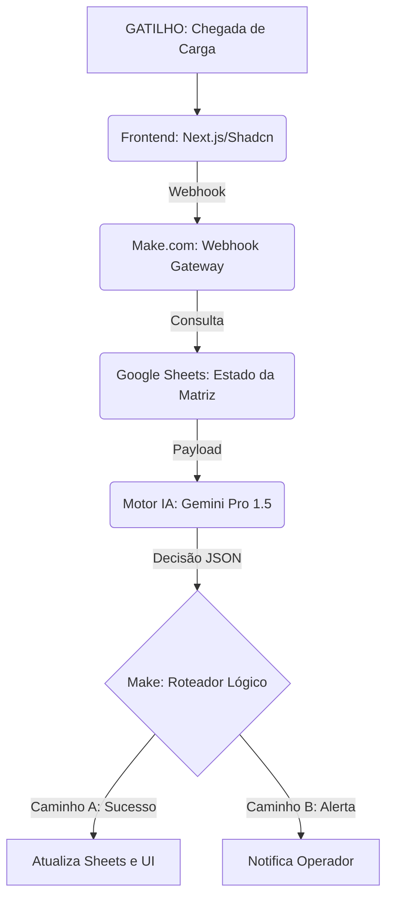
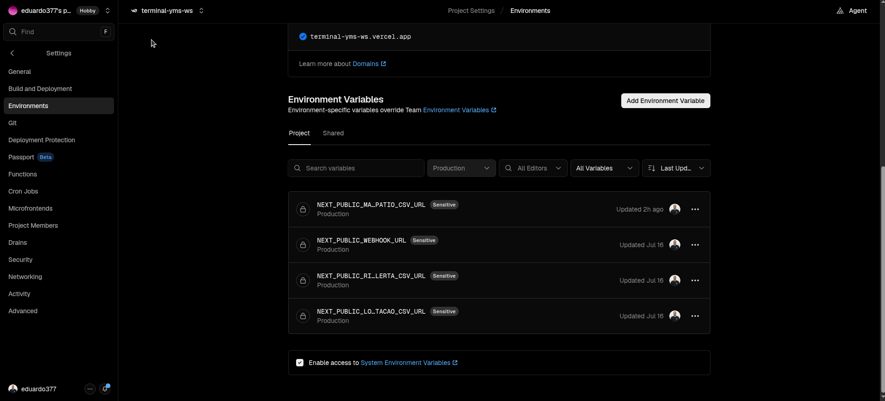

# 🏗️ Argos: Torre de Controle para Armazém Autoportante


**🔗 Aplicação Online:** [https://terminal-yms-ws.vercel.app/](https://terminal-yms-ws.vercel.app/)

---

## 📌 Visão Geral

O **Projeto Argos** é a evolução do sistema de gestão de pátios da Wilson Sons. Diferente da versão anterior voltada para contêineres, esta implementação foca no **Armazém Autoportante** de alta densidade. O sistema funciona como um Gêmeo Digital (Digital Twin) com motor de decisão assistido por IA (Gemini), integrando interface em tempo real com regras logísticas automatizadas.

## 🧠 Motor de Decisão (Regras de Negócio - Desafio 2)

A IA processa o estado atual do armazém aplicando três restrições críticas:

1. **Segurança (Cargas IMO):** Produtos perigosos são isolados em posições designadas via lógica do Make.com.
2. **Produtividade (Ocupação < 40%):** Restrição de movimentação de lança: a IA restringe a alocação aos níveis N1-N4 quando a ocupação global está abaixo de 40%.
3. **Física do Armazém:** Matriz expandida de 7 andares (Eixo Z), com validação de empilhamento (não permite alocação em N2 sem ocupação em N1).

---

### 📡 Teste de Integração (API / Webhook)

Para testar o Cérebro IA (roteirizador) diretamente via cliente HTTP (como ReqBin, Postman ou Insomnia), sem utilizar o dashboard Front-end, envie uma requisição `POST` para a URL do seu Webhook no Make.com utilizando a seguinte estrutura de dados.

**Endpoint (Exemplo):**
`POST [https://hook.us2.make.com/SEU_ID_DE_WEBHOOK](https://hook.us2.make.com/SEU_ID_DE_WEBHOOK)`

**Headers:**
`Content-Type: application/json`

**Body (Raw JSON):**

```json
{
  "id_conteiner": "MSCU-5544",
  "peso_ton": 8.5,
  "data_chegada": "2026-07-08",
  "data_saida_prevista": "2026-07-12",
  "IMO": "Sim"
}

```

**Dicionário de Dados:**

* `id_conteiner` *(string)*: Identificador alfa-numérico único do contêiner.
* `peso_ton` *(number)*: Peso da carga em toneladas. Utilizado pela IA para determinar a restrição de gravidade (pesados na base).
* `data_chegada` *(string)*: Data de registro no formato YYYY-MM-DD.
* `data_saida_prevista` *(string)*: Data programada de saída (YYYY-MM-DD). Utilizado para evitar alocação de cargas de longa permanência sobre cargas de saída rápida.
* `IMO` *(string)*: Flag de carga perigosa (`"Sim"` ou `"Nao"`). Se `"Sim"`, a IA restringe a alocação exclusivamente para a Rua 5 (isolamento).

**Resposta Esperada (200 OK):**
O Make.com processará a lógica via Gemini 1.5 e retornará a vaga alvo e a justificativa no seguinte formato:

```json
{
  "targetSlot": "C5-N1"
}

```

---

## ⚙️ Arquitetura Técnica

### Fluxo de Dados



---

## 📂 Estrutura do Repositório

```text
├── app/              # Rotas e Layouts (Next.js App Router)
│   ├── page.tsx
│   ├── layout.tsx
│   └── globals.css
├── components/   # Componentes Shadcn/UI e Lógica de Interface
│   │   ├── ui/
│   │   └── button.tsx
│   ├── terminal-dashboard.tsx
│   ├── yard-map.tsx      # Renderização da matriz 3D (7 níveis)
│   └── movement-form.tsx # Input para Carga IMO e dados logísticos
├── lib/              # Utilitários e Tipagens (Yard.ts)
│   ├── utils.ts
│   └── yard.ts
├── backend/          # Blueprint da automação Make.com
│   └── blueprint-roteirizador.json
├── docs/             # Arquitetura e Diagramas
│   ├── fluxo_make_automacao.png
│   └── FLOW_ARCHITECTURE.md
└── public/           # Assets e Icons
    ├── apple-icon.png
    ├── placeholder.jpg
    ├── icon-dark-32x32.png
    ├── icon-light-32x32.png
    ├── placeholder-logo.png
    ├── placeholder-user.jpg
    ├── icon.svg (300 tokens)
    ├── placeholder-logo.svg
    └── placeholder.svg

```
---

## 🛠️ Tecnologias Utilizadas

- **Frontend:** Next.js, TypeScript, Tailwind CSS, Shadcn/UI, Lucide React.
- **Backend/Orquestração:** Make.com (Low-Code/No-Code Integration).
- **IA Cognitiva:** Google Gemini API (Prompt Engineering focado em roteirização logística).
- **Database:** Google Sheets (Matriz de estados).

---

## 🚀 Como Executar Localmente

### Pré-requisitos

- Node.js (v18+)
- NPM ou PNPM
- Conta ativa no Make.com e Google Cloud (para API do Gemini)

### Passos de Instalação

1. **Clone o repositório:**

```bash
git clone https://github.com/Eduardo377/torre-controle-logistico-com-automacao_desafio-2

```

1. **Instale as dependências:**

```bash
npm install

```

ou

```bash
pnpm install
```

1. **Configure as variáveis de ambiente:**
   Crie um `.env.local` na raiz com o link do seu Webhook do Make.com.
2. **Inicie o servidor:**

```bash
npm run dev

```

ou

```bash
pnpm dev
```
---
## 🔒 Variáveis de Ambiente e Deploy

O projeto foi refatorado para utilizar o padrão de variáveis de ambiente (`process.env`), garantindo a segurança das credenciais e a separação total entre os ambientes de Desenvolvimento e Produção.

### Desenvolvimento Local (Sandbox)
Para rodar o projeto localmente, crie um arquivo `.env.local` na raiz do projeto contendo as URLs do seu ambiente de testes (ex: conta Make descartável):

```env
NEXT_PUBLIC_WEBHOOK_URL="sua_url_de_teste_aqui"
NEXT_PUBLIC_MAPA_PATIO_CSV_URL="sua_planilha_de_teste_aqui"
NEXT_PUBLIC_LOG_MOVIMENTACAO_CSV_URL="sua_planilha_de_teste_aqui"
NEXT_PUBLIC_RISCO_ALERTA_CSV_URL="sua_planilha_de_teste_aqui"
```

### Produção (Vercel)
Em produção, não utilizamos o arquivo `.env.local`. As URLs oficiais do ambiente da apresentação (conta Make principal e planilhas oficiais) devem ser cadastradas diretamente nas configurações do projeto na Vercel (aba *Settings* > *Environment Variables*), conforme o exemplo abaixo:



**Nota:** Lembre-se de realizar um *Redeploy* na Vercel sempre que alterar o valor de alguma dessas chaves.

---

## 📝 Documentação da Automação (Backend)

O arquivo `backend/blueprint-roteirizador.json` contém a arquitetura lógica do Make.com.

- **Ajustes necessários:** Importe este JSON no seu cenário do Make.com para replicar a lógica de busca do Google Sheets e a chamada à API do Gemini.
- **Customização:** A lógica da regra de 40% e o isolamento de cargas IMO está encapsulada no módulo `Generate a Response` (Gemini) do cenário.

---

## 🎓 Créditos e Contexto

Projeto desenvolvido como parte do desafio técnico da **KODIE Academy** em parceria com a **Wilson Sons**.

- **Versão:** 2.0.0
- **Status:** Em desenvolvimento (Refatoração de eixos para 7 andares concluída).

---

## 👨‍💻 Desenvolvido por

<a href="https://www.linkedin.com/in/eduardogomes377">
  
</a>
<br />
<strong>Eduardo Andrade</strong>
<br />
<em>Full Stack Developer</em>
<br /><br />
<a href="https://www.linkedin.com/in/eduardogomes377">
  
</a>
