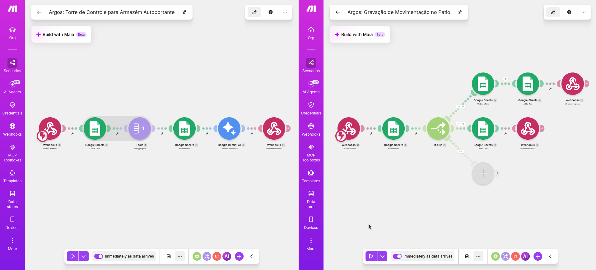

# Arquitetura de Automação (Backend - Make.com)

O sistema de roteirização do Argos WMS opera através de uma arquitetura de microsserviços baseada em automações de baixo código no Make.com. O backend foi dividido em dois fluxos distintos para separar a responsabilidade de "Raciocínio Lógico" (IA) e "Persistência de Dados" (Banco de Dados).

As chaves de comunicação entre a interface (Vercel) e os endpoints do Make.com são gerenciadas de forma segura via Variáveis de Ambiente (ex: `NEXT_PUBLIC_WEBHOOK_URL`).

## 1. Microsserviço: Torre de Controle (Cérebro IA)
Responsável por ler o estado atual da matriz 3D do pátio e acionar a Inteligência Artificial para determinar a melhor alocação baseada em regras de negócio rígidas.

1. **Webhook (Entrada):** Recebe os dados do novo contêiner (ID, peso, previsão de saída, flag IMO e zona alvo) enviados pelo formulário do frontend.
2. **Google Sheets (Busca):** Mapeia o estado atual do Armazém Autoportante (7 níveis de altura) para identificar vagas disponíveis e ocupadas.
3. **Google Gemini AI:** Analisa os dados recebidos cruzando-os com as 8 regras logísticas do terminal (isolamento IMO, peso, empilhamento, etc.).
4. **Webhook Response:** Devolve um JSON estruturado para o frontend informando o `targetId` ideal (ex: `FROZEN-A1-N1`) e a justificativa técnica.

## 2. Microsserviço: Gravação de Movimentação (Braço Mecânico)
Responsável por efetivar a persistência dos dados no Gêmeo Digital (Google Sheets) de forma assíncrona, ativado pelo evento de "Drag and Drop" do usuário.

1. **Webhook (Entrada):** Recebe o ID da vaga final validada e escolhida pelo usuário na interface.
2. **Google Sheets (Busca):** Localiza a coordenada exata da vaga no banco de dados oficial.
3. **Router (Fluxo de Decisão If-Else):**
   - *Caminho 1 (Update Row):* Atualiza os dados da célula específica com as informações do contêiner, alterando o status para 'Ocupado'.
   - *Caminho 2 (Add Row):* Executa rotinas de log adicionais, caso a regra de negócio exija a criação de um novo registro histórico.
4. **Webhook Response:** Confirma o sucesso da gravação de volta para a aplicação.

